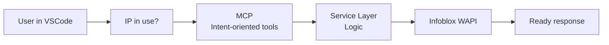
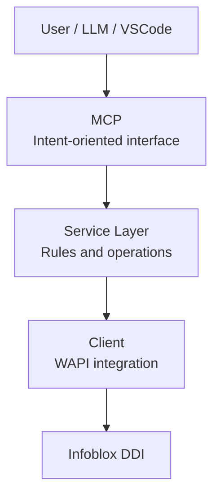

# How I built my first MCP for DNS operations

It is 2026, and I am not even sure people care that much about MCPs anymore.

From what I have seen, other approaches are already gaining traction, such as skills and more direct ways of integrating context and capabilities into assistants.

The AI market moves so fast that it is practically impossible to keep up with everything while still keeping your work routine, personal projects, and life running normally.

So if MCPs are already starting to fall behind, that is fine.

Even so, I wanted to write this post because the process of building this project was useful to me, and maybe it can help someone trying to solve a similar problem too.

Besides, this blog has been a little neglected lately...


## 💡 The idea

This MCP came out of a moment when I was studying AI and wanted to connect that learning to something in my day-to-day work: DDI operations, especially DNS.

The idea was simple:

> Build an assistant that responds to intentions, not one that requires API knowledge.

I wanted to stop thinking about endpoints, filters, and response formats, and start interacting more naturally, with prompts like:

- "Is this IP in use?"
- "Show me a summary of this zone"
- "Is there any issue in the grid?"

Sure, I could have done that by writing a script, but I did not want to keep writing code just to consume an API and retrieve routine operational information.


## 🧩 The real problem

Anyone who works with DNS/DDI knows how this usually goes: you need to know server details, zones, and records, and then either call the API or access the product GUI. `dig` and `nslookup` show what DNS is returning, but they do not show what is happening inside the environment.

For an operational or managerial view, that is simply not enough.

### ❌ Before (direct API)

Before I started using the MCP, the workflow looked like this:

- Figure out which endpoint to use
- Build the filters correctly
- Make the request
- Interpret the response
- Correlate the data

All of that just to answer relatively simple questions.


### ✅ After (with MCP)

Afterward, the workflow became:

- "Is this IP in use?"

And that was it. That was the main shift:

> Raise the level of abstraction from API calls to operational intent.




## ⚙️ What this MCP does today

In practice, it works as an intermediate layer between Infoblox DDI and a tool-oriented interface for LLMs. I use VSCode itself to talk to the MCP while I am building automations or whenever I need quick information, especially in troubleshooting scenarios where I would otherwise have to navigate the GUI or call the API to validate something.

The key point is this: it is not an API wrapper.

> I did not turn endpoints into tools. I turned real operations into an interface consumed through natural language.

Its main capabilities today are:

### 🔎 Basic lookup
- `list_zones`
- `list_records`

### 🔍 Search
- `search_dns_record`
- `check_ip_usage`

### 📊 Aggregated view
- `get_zone_summary`
- `get_dns_overview`
- `get_grid_status`
- `list_grid_members`

That makes it possible to answer questions such as:

- "Which zones exist today?"
- "Is this IP already in use?"
- "Is any grid member degraded?"
- "What is the overall DNS service health?"

## 🏗️ Architecture decisions

Some decisions were important to keep the project simple and useful:

### 1. Read-only first

Since we are talking about DNS and infrastructure, I started with read-only operations.

Before thinking about automation or write actions, I wanted to validate:

- Usefulness
- Response format
- Interaction with the model


### 2. Layer separation

The structure was intentionally simple:

- MCP (interface)
- Service (operational logic)
- Client (WAPI integration)
- Models (data structure)



That helped a lot with clarity and made the project easier to evolve.


## 🧠 The main lesson

The biggest lesson was this:

> Integrating AI with infrastructure is not about connecting APIs. It is about designing interfaces.

If you expose raw endpoints, the model has to figure out too much on its own. If you expose intent, the outcome improves dramatically.

That was the point where I started thinking about something slightly different: operational usability.


## 🤖 An unexpected lesson

Interestingly, one of the hardest parts was not building the project itself, but stopping AI from building everything for me.

I used Codex for support, but I had to control the pace:

- Asking for step-by-step guidance
- Requesting explanations
- Avoiding ready-made solutions

Because the goal here was not just to build it, but to understand it.


## 🚀 How to use it

To test the project:

If you want to download it, try it out, or even contribute to the project, the repository is here: [github.com/LuizMeier/mcp-ddi](https://github.com/LuizMeier/mcp-ddi).

### 1. Configure the variables

```bash
WAPI_URL
WAPI_USER
WAPI_PASS
WAPI_VERIFY_SSL
```

### 2. Start the environment

```bash
python3 -m venv .venv
source .venv/bin/activate
pip install -r requirements.txt
python3 main.py
```

After that, connect it to an MCP client and use prompts such as:

- "List the available DNS zones"
- "Show me the records for the zone example.com"
- "Check whether IP 10.10.10.15 is in use"
- "Give me a summary of the zone example.com"
- "What is the status of the grid?"


## 📐 Response consistency

One thing I cared about from the beginning was standardizing the output format of the tools.

They all follow a similar structure:

- operation
- success
- count
- data
- message

That reduces ambiguity and helps a lot when the consumer is an LLM.


## 🔭 Next steps

Some improvements I am considering:

- IPAM
- DHCP
- more context in the responses
- more complete troubleshooting flows


## 🧭 Conclusion

Maybe MCP is just another label that will eventually change, but the learning stays.

> The difference is not in the model. It is in the interface you give it.

In the end, this whole experiment was about learning how to abstract a technical solution into something that makes sense to both humans and AI.

I hope it is useful. See you around!
