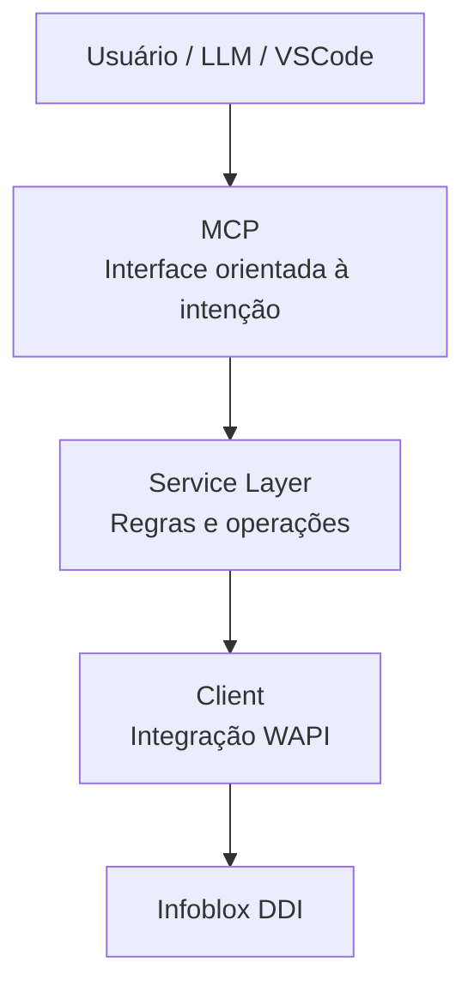

# Como construí meu primeiro MCP para operações de DNS

Estamos em 2026 e eu já nem sei mais se as pessoas ainda se importam tanto com MCPs.

Pelo que tenho acompanhado, outras abordagens já começam a ganhar mais espaço (skills) e formas mais diretas de integrar contexto e capacidades aos assistentes.

O mercado de IA anda tão rápido que é praticamente impossível acompanhar tudo e, ao mesmo tempo, manter a rotina de trabalho, os projetos pessoais e a vida funcionando normalmente.

Então, se MCPs já estiverem ficando para trás, tudo bem.

Ainda assim, quis escrever este post porque o processo de construir esse projeto foi útil para mim — e talvez também seja útil para alguém tentando resolver um problema parecido.

Além disso, esse blog anda um tanto abandonado...


## 💡 A ideia

Esse MCP surgiu quando eu estava estudando IA e quis conectar o aprendizado com algo do meu dia a dia: operações de DDI, especialmente DNS.

A ideia era simples:

> Criar um assistente que respondesse intenções — não que exigisse conhecimento da API.

Eu queria parar de pensar em endpoints, filtros e formatos de resposta, e começar a interagir de forma mais natural, como:

- "Esse IP está em uso?"
- "Me mostra um resumo dessa zona"
- "Tem algum problema no grid?"

Ok, eu poderia fazer isso desenvolvendo algum script, mas eu não queria ter que ficar criando código pra consumir API e conseguir informações do dia a dia.


## 🧩 O problema real

Quem trabalha com DNS/DDI sabe como isso normalmente funciona: você precisa saber dados do servidor, zona, registros e tem que ou chamar a API ou acessar a GUI da solução. `dig` e `nslookup` mostram o que o DNS responde mas não mostram o que está acontecendo no ambiente.

Para uma visão operacional ou gerencial, isso simplesmente não basta.

### ❌ Antes (API direta)

O cenário antes de começar a usar o MCP era:

- Descobrir qual endpoint usar  
- Montar filtros corretamente  
- Fazer a chamada  
- Interpretar a resposta  
- Correlacionar dados  

Tudo isso para responder perguntas relativamente simples.


### ✅ Depois (com MCP)

Depois o cenário mudou para:

- "Esse IP está em uso?"

E pronto. Essa foi a mudança principal:

> Subir o nível de abstração da API para intenção operacional.


## ⚙️ O que esse MCP faz hoje

Na prática, ele funciona como uma camada intermediária entre o Infoblox DDI e uma interface orientada a tools para LLMs. Eu uso o meu próprio VSCode pra falar com o MCP enquanto estou desenvolvendo qualquer rotina/automação ou se preciso de qualquer informação rápida. Principalmente situações de troubleshooting, onde normalmente eu teria que navegar pela GUI ou chamar a API para validar alguma coisa.

O importante é: não é um wrapper de API.

> Eu não transformei endpoints em tools. Eu transformei operações reais em interface consumida via linguagem natural.

As principais capacidades hoje são:

### 🔎 Consulta básica
- `list_zones`
- `list_records`

### 🔍 Busca
- `search_dns_record`
- `check_ip_usage`

### 📊 Visão agregada
- `get_zone_summary`
- `get_dns_overview`
- `get_grid_status`
- `list_grid_members`

Isso permite responder coisas como:

- "Quais zonas existem hoje?"
- "Esse IP já está sendo usado?"
- "Tem algum membro do grid degradado?"
- "Como está a saúde geral do serviço de DNS?"

## 🏗️ Decisões de arquitetura

Algumas decisões foram importantes para manter o projeto simples e útil:

### 1. Read-only primeiro

Como estamos falando de DNS e infraestrutura, comecei apenas com leitura.

Antes de pensar em automação ou escrita, eu queria validar:

- Utilidade
- Formato das respostas
- Interação com o modelo


### 2. Separação de camadas

A estrutura ficou propositalmente simples:

- MCP (interface)
- Service (lógica operacional)
- Client (integração com WAPI)
- Models (estrutura de dados)



Isso ajudou muito na clareza e evolução do projeto.


## 🧠 O principal aprendizado

A maior lição foi essa:

> Integrar IA com infraestrutura não é sobre conectar APIs, e sim sobre desenhar interfaces.

Se você expõe endpoints crus, o modelo precisa descobrir muita coisa sozinho. Se você expõe intenção, o resultado melhora drasticamente.

Foi nesse ponto que comecei a pensar em algo diferente: facilidade operacional.


## 🤖 Um aprendizado inesperado

Curiosamente, uma das partes mais difíceis não foi construir o projeto, e sim evitar que a IA construísse tudo por mim.

Eu usei o Codex como apoio, mas precisei controlar o ritmo:

- Pedindo passo a passo
- Solicitando explicações
- Evitando soluções prontas

Porque o objetivo aqui não era só construir — era entender.


## 🚀 Como usar

Para testar o projeto:

Se quiser baixar, testar ou até contribuir com a evolução do projeto, o repositório está aqui: [github.com/LuizMeier/mcp-ddi](https://github.com/LuizMeier/mcp-ddi).

### 1. Configure as variáveis

```bash
WAPI_URL
WAPI_USER
WAPI_PASS
WAPI_VERIFY_SSL
```

### 2. Suba o ambiente

```bash
python3 -m venv .venv
source .venv/bin/activate
pip install -r requirements.txt
python3 main.py
```

Depois disso, conecte a um cliente MCP e use prompts como:

- "Liste as zonas DNS disponíveis"
- "Mostre os registros da zona example.com"
- "Verifique se o IP 10.10.10.15 está em uso"
- "Me dê um resumo da zona example.com"
- "Como está o status do grid?"


## 📐 Consistência das respostas

Uma coisa que cuidei desde o início foi padronizar o retorno das tools.

Todas seguem um formato parecido:

- operação
- sucesso
- quantidade
- dados
- mensagem

Isso reduz ambiguidade e ajuda bastante quando o consumidor é um LLM.


## 🔭 Próximos passos

Algumas evoluções que penso:

- IPAM
- DHCP
- mais contexto nas respostas
- fluxos mais completos de troubleshooting


## 🧭 Conclusão

Talvez MCP seja só mais um nome que vai mudar mas o aprendizado fica.

> A diferença não está no modelo — está na interface que você entrega para ele.

No fim essa brincadeira foi sobre aprender a abstrair solução técnica para algo que faça sentido para humanos e IA.

Espero que seja útil. Grande abraço!
