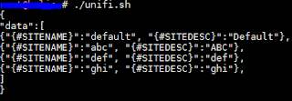
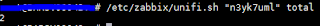
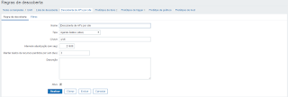
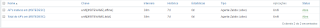
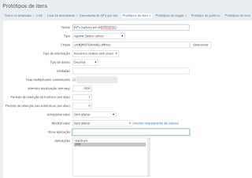

  
Neste post vou tentar dar o caminho das pedras para quem tem um ambiente com antenas Unifi e deseja saber a saúde desses dispositivos.  
  
Para os afobados que querem somente o script, pode baixá-lo [aqui](https://github.com/LuizMeier/Zabbix/blob/master/Unifi/unifi.sh). E o template [aqui](https://raw.githubusercontent.com/LuizMeier/Zabbix/master/Unifi/Template_Unifi.xml).  
  
Para quem não sabe, Unifi são os pontos de acesso da [Ubiquiti](https://www.ubnt.com/), focados para ambiente empresarial, com a possibilidade de ter um controlador centralizado. Através deste controlador você configura os seus pontos de acesso, podendo separá-los por sites, com configurações específicas para cada ambiente.  
  
Neste procedimento, monitoraremos a quantidade e o status das antenas já previamente adicionadas ao seu controlador. O exemplo aqui é feito com um Unifi Controller instalado em um Debian 8 x64.  
Posto isto, mãos à obra:  
  
1) Acesse seu controlador via ssh e baixe os arquivos do [github](https://github.com/LuizMeier/Zabbix/tree/master/Unifi). Ou use outra estação para baixar e copie os arquivos para dentro da sua máquina onde está seu controlador. O que preferir.  
  
2) Copie o arquivo unifi.sh para /etc/zabbix/ e  unifi_sh_api para /usr/lib/unifi/bin/  
  
3) Edite o arquivo unifi_sh_api, informando os dados do seu ambiente. Este ambiente é carregado toda vez que unifi.sh é chamado, e contém todas as configurações para login do script na aplicação para coleta dos dados.  
_**username=**_  
_**password=**_  
_**baseurl=https://**_  
_**site=default**_  
  
  
4) Para testar o funcionamento do script, vamos executá-lo:  
```bash
/etc/zabbix/unifi.sh
```  




Veja que o retorno foi uma saída em formato JSON, que é o formato que o Zabbix utiliza para fazer o LLD, que é o processo de descoberta de itens de monitoramento, de forma dinâmica. Entenda mais sobre LLD [aqui](https://www.zabbix.com/documentation/3.0/pt/manual/discovery/low_level_discovery).  
  
Caso queiramos outras informações a respeito de um site específico, devemos informar o nome do site e a informação que desejamos. É possível saber quantos APs temos ao total, offline e online.  
Por exemplo, caso queira saber o total de pontos de acesso no site default, execute o comando abaixo:  
  
```bash
/etc/zabbix/unifi.zabbix default total  
```  
A saída será a quantidade total de dispositivos.  
  



Coletando valores de site específico

  
  
5) Agora vamos editar o arquivo de configuração do Zabbix, adicionando um parâmetro de usuário. Um parâmetro de usuário nada mais é do que uma forma customizada de uma chave de monitoramento. É uma chave que criaremos por conta para fazer um tipo de de coleta que nos interessa.  
Essa é uma das melhores sacadas dessa solução, ao meu ver. É possível monitorar qualquer dado, desde que ele seja passível de coleta de alguma forma. Entenda mais sobre parâmetros de usuário [aqui](https://www.zabbix.com/documentation/3.0/pt/manual/config/items/userparameters).  
  
Vamos adicionar ao final do arquivo de configuração do Zabbix a configuração desse novo parâmetro de usuário. Se você leu a documentação, já deve saber que informa-se o nome da chave e depois o comando que ela executará, separado por vírgulas.  
Execute o comando abaixo ou use o seu editor de texto preferido para criar a nossa nova chave:  
```bash
echo 'UserParameter=unifi[*],/etc/zabbix/unifi.sh $1 $2' > /etc/zabbix/zabbix_agentd.conf  
```  
Para checar se o comando funcionou, execute o comando abaixo. O retorno deve ser o conteúdo do echo que executamos acima.  
  
```bash
cat /etc/zabbix/zabbix_agentd.conf | grep ^UserParameter>
```
_$1 e $2 são a declaração dos parâmetros que essa chave pode receber._  
  
Isto feito, reinicie o serviço do agente Zabbix.  
  
```bash
service zabbix-agent restart  
```  
  
6) Agora vamos testar através do Zabbix. Acesse seu servidor Zabbix via ssh e então vamos tentar coletar os dados manualmente.  
Primeiramente tente executar o LLD:  
  
```bash
zabbix_get -s SERVIDOR_UNIFI -p PORTA -k unifi  
```

Agora tentemos coletar a quantidade de pontos de acesso no site default:  
  
```bash
zabbix_get -s SERVIDOR\_UNIFI -p PORTA -k unifi\[default,total\]  
```  

7) Finalmente, adicionaremos os itens ao Zabbix. Crie um novo template (ou configure direto em um host, como preferir) e vá em _Regras de Descoberta_ e adicione uma nova regra conforme abaixo:  
  



Criando regra de descoberta

  
Esta regra faz com que seja gerado o processo de descoberta periodicamente. Para o meu ambiente estipulei que a cada 6 horas é um bom número.  
Após isto, vamos criar os itens em _Protótipos de Itens:_  



Visão geral dos protótipos de item



Detalhes de um protótipo de item

  
Veja que agora montamos a chave inteira do Zabbix, usando a macro do site que é gerado na saída JSON. Dessa forma o processo irá criar um item deste para cada site encontrado na regra de descoberta.  
  
Se tudo der certo, crie seus outros itens conforme a sua necessidade. No mesmo diretório onde estão os scripts eu disponibilizei um template para os dados abordados nesse tutorial.  
  
Espero que possa ser útil.  
  
Grande Abraço!